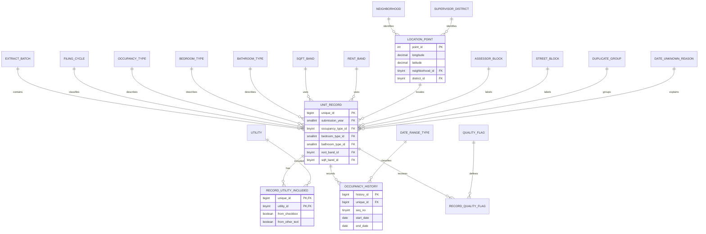

# 3NF ER/EER diagram

The complete implementation is in `SF_Rent_Board_schema_3nf.sql`. The diagram
below shows the main entities and relationship directions. Lookup tables are
shown separately from the main fact table, and the multi-valued data is modeled
with child/junction tables.

The current local CSV has blank neighborhood and district labels, so those
foreign keys remain nullable when this particular file is loaded.
